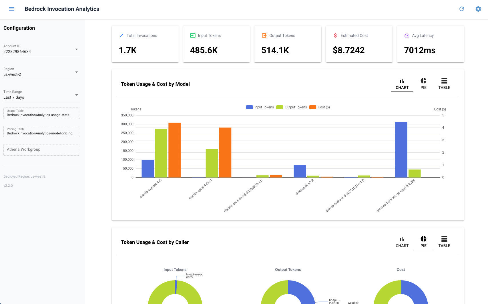

# Bedrock 调用日志分析

[English](../README.md) | 中文

Amazon Bedrock 实时分析 — 监控多账户的 Token 用量、成本和性能。

## 架构

```
Bedrock API → 调用日志 → S3 (JSON.gz)
                            │ S3 事件 (EventBridge)
                            ▼
                         Lambda ETL → DynamoDB (聚合数据)
                                          │
                                          ▼
                                     WebUI (仪表盘)
```

**工作原理：**
1. Bedrock 将调用日志以压缩 JSON 格式写入 S3
2. 每个新日志文件触发 Lambda，解析 Token、延迟、调用者信息并计算成本
3. 聚合统计数据存入 DynamoDB（按模型、按调用者、汇总 — 小时/天/月粒度）
4. WebUI 从 DynamoDB 读取数据，亚秒级加载

## WebUI



**功能：**
- 概览卡片：调用次数、输入/输出 Token、预估成本、平均延迟
- 按模型和调用者的 Token 用量与成本图表（图表/表格切换）
- 使用趋势
- 多账户、多区域支持（侧栏选择器）
- 响应式布局（桌面和移动端）

## 前置条件

- [AWS CDK CLI](https://docs.aws.amazon.com/cdk/v2/guide/getting-started.html)（`npm install -g aws-cdk`）
- [uv](https://docs.astral.sh/uv/)（Python 包管理器）
- 已配置 AWS 凭证（`aws configure` 或 `~/.aws/credentials`）

## 部署

```bash
# 安装依赖
uv sync

# 初始化 CDK（仅首次需要）
./deploy.sh bootstrap --region us-west-2 --profile YOUR_PROFILE

# 创建新 S3 存储桶部署
./deploy.sh deploy --profile YOUR_PROFILE \
  --parameters ExistingBucketName="" LogPrefix="bedrock/invocation-logs/"

# 使用已有 S3 存储桶部署
./deploy.sh deploy --profile YOUR_PROFILE \
  --parameters ExistingBucketName=你的桶名 LogPrefix="bedrock/invocation-logs/"
```

> 使用已有存储桶时，需启用 S3 EventBridge 通知：
> ```bash
> aws s3api put-bucket-notification-configuration --bucket 你的桶名 \
>   --notification-configuration '{"EventBridgeConfiguration": {}}'
> ```

### 部署资源

| 资源 | 用途 |
|------|------|
| Custom Resource | 配置 Bedrock 调用日志 |
| DynamoDB 表 × 2 | 用量统计聚合 + 模型定价 |
| Lambda 函数 × 2 | 日志处理（事件驱动）+ 统计汇总（定时调度） |
| EventBridge × 3 | S3 触发器 + 每日/每月汇总调度 |
| S3 存储桶（可选） | 原始日志，含加密、生命周期、EventBridge 通知 |

## 初始化定价数据

定价数据来源于 [LiteLLM](https://github.com/BerriAI/litellm)（覆盖 286+ Bedrock 模型）：

```bash
AWS_DEFAULT_REGION=us-west-2 python3 scripts/seed_pricing.py \
  BedrockInvocationAnalytics-model-pricing YOUR_PROFILE
```

## 启动 WebUI

```bash
./start-webui.sh --region us-west-2 --profile YOUR_PROFILE
```

浏览器打开 http://localhost:8080

## 项目结构

```
├── deploy/
│   ├── cdk.json              # CDK 配置
│   ├── app.py                # CDK 应用入口
│   ├── stack.py              # Stack 定义
│   └── lambda/
│       ├── process_log.py    # ETL：S3 事件 → 解析 → DDB 聚合
│       └── aggregate_stats.py # 汇总：HOURLY → DAILY → MONTHLY
├── webui/
│   ├── app.py                # NiceGUI 仪表盘
│   └── data.py               # DynamoDB 数据访问层
├── scripts/
│   └── seed_pricing.py       # 从 LiteLLM 导入定价
├── deploy.sh                 # CDK 便捷脚本
├── start-webui.sh            # WebUI 启动脚本
└── pyproject.toml            # 依赖管理（uv）
```

## 清理

```bash
./deploy.sh destroy --profile YOUR_PROFILE
```

> DynamoDB 表和 S3 存储桶在删除 Stack 后会保留（RemovalPolicy: RETAIN）。

## 成本

| 服务 | 定价 | 说明 |
|------|------|------|
| DynamoDB | 按请求付费 | 约 $1.25/百万次写入，读取可忽略 |
| Lambda | $0.20/百万次请求 | 每个日志文件约 60ms |
| S3 | 约 $0.023/GB/月 | 90 天后自动转为低频存储 |

**月度估算**（100 万次 Bedrock 调用）：
- Lambda：约 $0.20
- DynamoDB：约 $4（每次调用 3 次写入）
- S3：约 $1（累计日志存储）
- **合计：约 $5/月**
